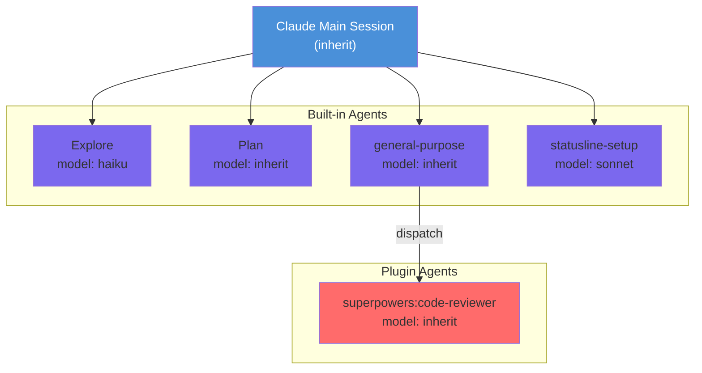

# agents 可视化设计方案

## 可视化方向建议

### 方向一：Agent 拓扑关系图

展示所有 agent 的层级结构和调用关系。

```
┌─────────────────────────────────────────────┐
│              Claude Main Session             │
│                  (inherit)                    │
├─────────────┬───────────┬───────────────────┤
│             │           │                   │
▼             ▼           ▼                   ▼
┌──────┐  ┌──────┐  ┌──────────┐  ┌────────────────┐
│Explore│  │ Plan │  │general-  │  │statusline-setup│
│(haiku)│  │(inherit)│purpose  │  │   (sonnet)     │
└──────┘  └──────┘  │(inherit)│  └────────────────┘
  │                 └──────┘        │
  │   Plugin Layer                  │
  │  ┌───────────────────┐         │
  └─►│code-reviewer      │         │
     │   (inherit)        │         │
     └───────────────────┘         │
```

**Mermaid 代码:**



### 方向二：模型分配与成本看板

展示每个 agent 的模型配置和预估资源消耗。

```
┌──────────────────────────────────────────────────┐
│            Agent Model Allocation                 │
├────────────────────┬─────────┬───────────────────┤
│ Agent              │ Model   │ Est. Cost/Token   │
├────────────────────┼─────────┼───────────────────┤
│ Explore            │ haiku   │ $ (lowest)        │
│ Plan               │ inherit │ $$ (varies)       │
│ general-purpose    │ inherit │ $$ (varies)       │
│ statusline-setup   │ sonnet  │ $$$ (medium)      │
│ code-reviewer      │ inherit │ $$ (varies)       │
└────────────────────┴─────────┴───────────────────┘

Model Distribution:
  inherit  ████████████████  3 agents
  haiku    ████              1 agent
  sonnet   ████████          1 agent
```

## 用户交互流程

1. 用户执行 `claude agents` → 终端输出纯文本列表
2. 可视化工具解析输出 → 渲染拓扑图/看板
3. 用户可点击 agent 节点 → 查看详细信息（工具权限、能力描述、配置来源）

## 数据流设计

```
claude agents --setting-sources <sources>
       │
       ▼
  [输出捕获] stdout 纯文本
       │
       ▼
  [文本解析器] → 提取 agent 名称、模型、分类(builtin/plugin)
       │
       ▼
  [数据模型] { name, model, type, source }
       │
       ▼
  [可视化渲染] → 拓扑图 / 看板 / 矩阵
```

## 技术建议

- 解析简单，基于正则匹配即可提取结构化数据
- 可扩展支持 `--output-format json`（如未来支持）
- 建议集成到 IDE 插件侧边栏，而非独立页面
