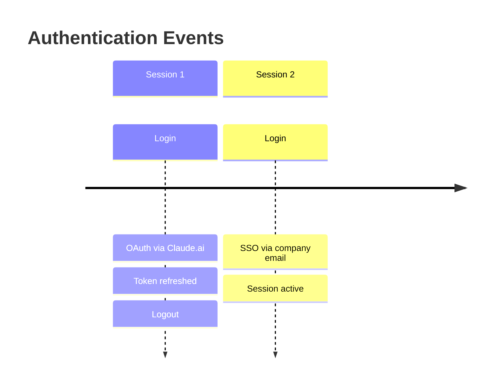

# auth 可视化设计方案

## 可视化方向建议

### 方向一：认证状态卡片

展示当前认证的核心信息，适合 IDE 侧边栏或状态栏集成。

```
┌──────────────────────────────────┐
│  🔐 Authentication Status        │
│                                   │
│  Status:    ✅ Logged In          │
│  Method:    OAuth Token           │
│  Provider:  First Party           │
│  Base URL:  https://ruoli.dev     │
│                                   │
│  ┌─────────────┐ ┌─────────────┐ │
│  │  🔄 Refresh │ │  🚪 Logout  │ │
│  └─────────────┘ └─────────────┘ │
└──────────────────────────────────┘
```

### 方向二：认证生命周期时间线

追踪认证状态变化历史。



### 方向三：多账户切换面板

支持在多个认证配置间快速切换。

```
┌────────────────────────────────────┐
│  Account Switcher                   │
│                                     │
│  ● Claude Subscription (active)     │
│    OAuth · first-party              │
│                                     │
│  ○ Anthropic Console                │
│    API Key · console                │
│                                     │
│  ○ Enterprise SSO                   │
│    SSO · company.com                │
│                                     │
│  [+ Add Account]                    │
└────────────────────────────────────┘
```

## 用户交互流程

1. 用户查看状态 → 快速了解当前认证是否有效
2. Token 过期提醒 → 自动检测并提示重新认证
3. 切换账户 → 下拉选择，自动执行 logout + login 流程

## 数据流设计

```
claude auth status --json
       │
       ▼
  { loggedIn, authMethod, apiProvider }
       │
       ▼
  [状态映射] → ✅ 已登录 / ❌ 未登录 / ⚠️ Token 即将过期
       │
       ▼
  [UI 渲染] → 状态卡片 / 时间线 / 切换面板
```

## 技术建议

- JSON 输出格式非常适合程序化解析
- 可结合 Token 过期时间（如可获取）实现主动提醒
- 建议作为 IDE 状态栏组件，而非独立页面
