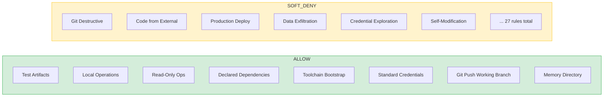
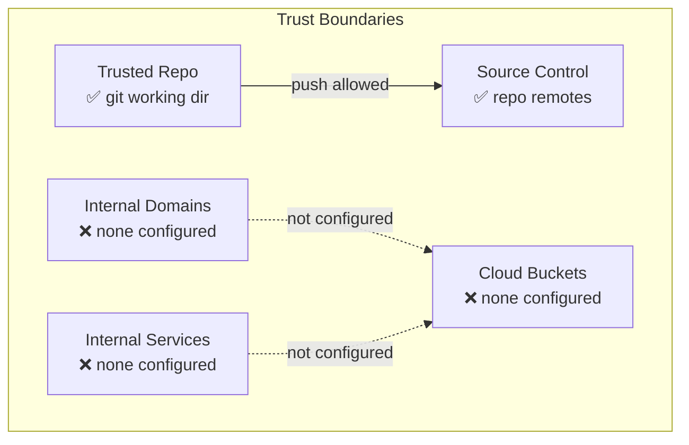

# auto-mode 可视化设计方案

## 可视化方向建议

### 方向一：安全规则矩阵图（推荐优先实现）

将 35+ 条规则按类别和风险等级进行二维可视化。

```
┌─────────────────────────────────────────────────────────────┐
│              Auto-Mode Security Rules Matrix                 │
├──────────────┬──────────┬──────────┬───────────┬────────────┤
│ Category     │ LOW RISK │ MED RISK │ HIGH RISK │ CRITICAL   │
├──────────────┼──────────┼──────────┼───────────┼────────────┤
│ Git Ops      │ Push to  │ Force    │ Push to   │            │
│              │ working  │ push     │ default   │            │
│              │ branch   │          │ branch    │            │
├──────────────┼──────────┼──────────┼───────────┼────────────┤
│ Code Safety  │ Declared │ Toolchain│ External  │ RCE        │
│              │ deps     │ bootstrap│ code exec │ surface    │
├──────────────┼──────────┼──────────┼───────────┼────────────┤
│ Credentials  │ Standard │          │ Leak/Expl │ Exfil      │
├──────────────┼──────────┼──────────┼───────────┼────────────┤
│ Infrastructure│ Local   │          │ Prod      │ Mass delete│
│              │ ops      │          │ deploy    │            │
├──────────────┼──────────┼──────────┼───────────┼────────────┤
│ Persistence  │ Memory   │          │ Self-mod  │ Unauth     │
│              │ dir      │          │           │ persist    │
└──────────────┴──────────┴──────────┴───────────┴────────────┘

Legend: 🟢 ALLOW  🟡 SOFT-DENY (user override)  🔴 DENY
```

**Mermaid 代码:**



### 方向二：信任边界雷达图

展示环境中定义的信任范围。



### 方向三：Config vs Defaults 差异视图

高亮展示自定义覆盖了哪些默认规则。

```
┌─────────────────────────────────────┐
│  Config Diff: Custom vs Default     │
│                                     │
│  allow:                             │
│    ✅ Test Artifacts        (same)  │
│    ✅ Local Operations      (same)  │
│    📝 Custom Rule Added    (+)     │
│                                     │
│  soft_deny:                         │
│    ✅ Git Destructive      (same)  │
│    ⚠️ Prod Deploy Modified  (~)    │
│    📝 Extra Deny Added     (+)     │
│                                     │
│  environment:                       │
│    ✅ Trusted Repo        (same)   │
│    📝 Added Internal Dom   (+)     │
└─────────────────────────────────────┘
```

## 用户交互流程

1. 用户查看规则矩阵 → 快速了解整体安全态势
2. 点击具体规则 → 展开详细描述和适用场景
3. 切换 config/defaults → 对比自定义修改
4. 调用 critique → 在侧面板显示 AI 评审建议

## 数据流设计

```
claude auto-mode config --json  (或 defaults)
       │
       ▼
  [JSON Parser] → 提取 allow[], soft_deny[], environment[]
       │
       ▼
  [规则分类器] → 按类别归类 (Git/Credentials/Infra/Safety/...)
       │
       ▼
  [风险评估] → 为每条规则标注风险等级
       │
       ▼
  [可视化渲染] → 矩阵图 / 雷达图 / 差异视图
```

## 技术建议

- 输出为标准 JSON，非常适合程序化处理
- 建议实现 diff 算法，对比 config 与 defaults 的差异
- 规则分类可基于关键词自动归类（Git/Credential/Production/Security/...）
- 优先实现矩阵图，信息密度最高，用户价值最大
