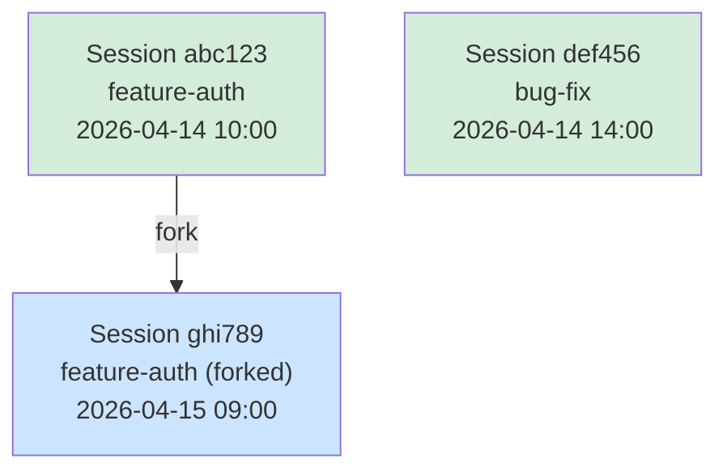
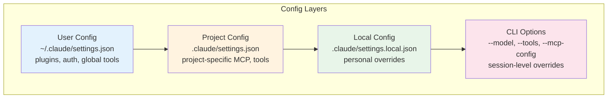

# CLI 选项可视化设计方案

## 一、会话管理时间线（高优先级）

展示所有会话的历史、关系和恢复路径。



```
┌─────────────────────────────────────────────────────┐
│  📂 Session History                                  │
│                                                      │
│  Timeline:                                           │
│  ──●────────●────────────●────────────── Now        │
│    │        │            │                            │
│    ▼        ▼            ▼                            │
│  [abc123] [def456]    [ghi789]                       │
│  auth     bugfix      auth-fork                       │
│  2h ago   1d ago      30m ago                        │
│                                                      │
│  Actions: [Resume] [Fork] [Rename]                   │
└─────────────────────────────────────────────────────┘
```

## 二、工具权限矩阵（高优先级）

可视化编辑 allowedTools / disallowedTools。

```
┌───────────────────────────────────────────────────────┐
│  🔧 Tool Permissions Editor                            │
│                                                        │
│  Mode: [default ▾]                                     │
│                                                        │
│  Tool           │ Pattern              │ Status        │
│  ───────────────┼──────────────────────┼────────────── │
│  Bash           │ git *                │ ✅ Allowed    │
│  Bash           │ rm *                 │ ❌ Denied     │
│  Bash           │ npm *                │ ✅ Allowed    │
│  Edit           │ *                    │ ✅ Allowed    │
│  Read           │ *                    │ ✅ Allowed    │
│  Write          │ .env                 │ ❌ Denied     │
│                                                        │
│  [+ Add Rule]                                         │
└───────────────────────────────────────────────────────┘
```

## 三、模型选择器（中优先级）

展示模型选项和 effort 级别的交互式选择。

```
┌──────────────────────────────────────┐
│  🤖 Model Configuration              │
│                                       │
│  Primary Model:                       │
│  ○ Haiku (fast, cheap)               │
│  ● Sonnet (balanced)                  │
│  ○ Opus (powerful, expensive)         │
│                                       │
│  Effort Level:                        │
│  [low] [medium] [● high] [max]       │
│                                       │
│  Fallback Model:                      │
│  [sonnet ▾]                           │
│                                       │
│  Est. cost: $0.02 - $0.15/msg        │
└──────────────────────────────────────┘
```

## 四、配置来源层级图（中优先级）

展示三级配置的继承关系。



## 用户交互流程

1. 会话管理：浏览历史 → 恢复/分叉 → 继续工作
2. 权限编辑：选择工具 → 设置模式 → 预览影响
3. 模型选择：对比选项 → 调整 effort → 估算成本
4. 配置层级：查看继承链 → 定位覆盖点

## 数据流设计

```
claude --help / 各命令 --help
       │
       ▼
  [选项分类器] → 6 大类 50+ 选项
       │
       ▼
  [功能映射] → 每个选项关联到具体功能模块
       │
       ▼
  [可视化渲染] → 时间线 / 矩阵 / 选择器 / 层级图
```

## 技术建议

- CLI 选项分析不需要运行时数据，纯文档型可视化
- 会话管理需集成 session 存储解析
- 权限编辑器需生成命令行参数字符串
- 配置层级图有助于调试"配置不生效"问题
- 建议作为 IDE 设置页面的可视化增强
