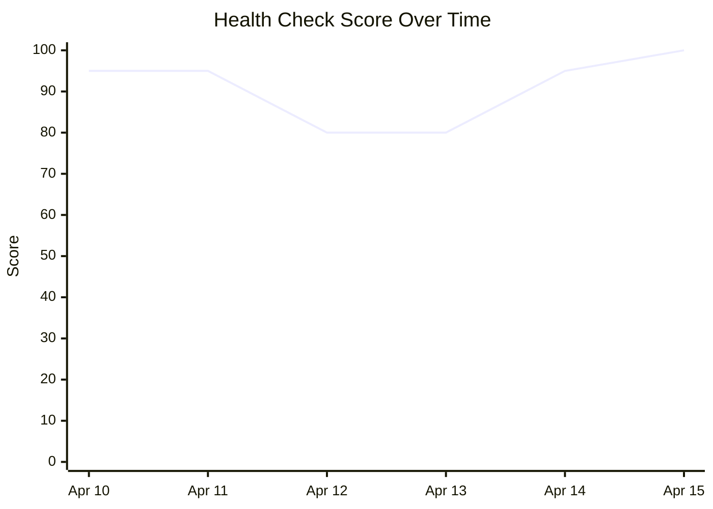

# doctor 可视化设计方案

## 可视化方向建议

### 方向一：健康检查仪表盘

将 doctor 检查结果以卡片式仪表盘展示。

```
┌──────────────────────────────────────────────┐
│         Claude Code Health Dashboard          │
│         Last Check: 2026-04-15 14:30          │
├────────────────┬─────────────────────────────┤
│                │                              │
│  ✅ Auto       │  ✅ MCP Servers               │
│  Updater      │  3/3 servers healthy          │
│  v1.0.3       │  • figma: running             │
│  Up to date   │  • playwright: running        │
│                │  • web-reader: running        │
├────────────────┼─────────────────────────────┤
│                │                              │
│  ✅ Auth       │  ✅ Node.js                   │
│  OAuth token  │  v22.x                        │
│  Valid        │  Memory: 512MB                │
│                │                              │
└────────────────┴─────────────────────────────┘
```

### 方向二：历史趋势图

追踪多次健康检查的结果变化。



### 方向三：团队环境矩阵

多开发者环境健康对比。

```
┌─────────────┬──────────┬──────────┬──────────┬──────────┐
│ Check Item  │ Dev A    │ Dev B    │ CI       │ Staging  │
├─────────────┼──────────┼──────────┼──────────┼──────────┤
│ Auto-update │ ✅ v1.0.3│ ✅ v1.0.3│ ✅ v1.0.3│ ❌ v0.9.0│
│ Auth        │ ✅ OAuth │ ✅ API   │ ✅ API   │ ❌ Expired│
│ MCP Servers │ ✅ 3/3   │ ⚠️ 2/3  │ ✅ 3/3   │ ❌ 0/3   │
│ Node.js     │ ✅ v22   │ ✅ v22   │ ✅ v20   │ ✅ v22   │
└─────────────┴──────────┴──────────┴──────────┴──────────┘
```

## 用户交互流程

1. 用户运行 `claude doctor` → 自动捕获输出
2. 解析检查结果 → 渲染仪表盘
3. 检查失败项 → 展示修复建议
4. 历史记录 → 趋势图展示稳定性变化

## 数据流设计

```
claude doctor (交互式输出)
       │
       ▼
  [输出捕获] → 终端 ANSI 输出
       │
       ▼
  [结构化解析] → 提取各检查项状态
       │
       ▼
  [数据模型] { checkItems[], timestamp, score }
       │
       ▼
  [持久化] → 本地历史记录
       │
       ▼
  [可视化渲染] → 仪表盘 / 趋势图 / 矩阵
```

## 技术建议

- doctor 当前输出为终端 UI，非结构化格式，需 ANSI 解析
- 建议未来向 Claude Code 团队提议增加 `--json` 输出选项
- 短期方案：基于 ANSI 转义序列解析 + 正则匹配提取状态
- 团队环境对比需配合共享存储（如 CI artifacts 或团队服务器）
