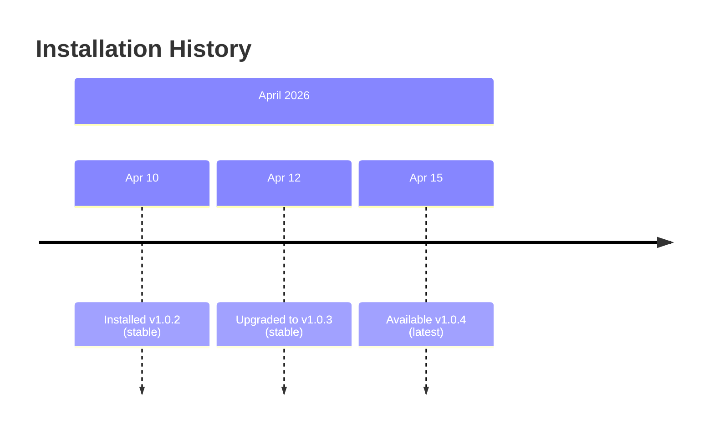

# install 可视化设计方案

## 可视化方向建议

### 方向一：版本选择器

展示可用版本和安装状态。

```
┌──────────────────────────────────────────┐
│  Claude Code Version Manager              │
│                                           │
│  Current: v1.0.3 (stable)                 │
│                                           │
│  Available Versions:                      │
│  ┌──────────────────────────────────────┐ │
│  │ ⭐ v1.0.4  latest    [Install]       │ │
│  │ ✅ v1.0.3  stable  ← current        │ │
│  │    v1.0.2            [Install]       │ │
│  │    v1.0.1            [Install]       │ │
│  │    v1.0.0            [Install]       │ │
│  └──────────────────────────────────────┘ │
│                                           │
│  [Force Reinstall Current]                │
└──────────────────────────────────────────┘
```

### 方向二：安装进度可视化

```
┌──────────────────────────────────────┐
│  Installing Claude Code v1.0.4       │
│                                       │
│  Downloading  ████████████░░░  78%   │
│  Verifying    ░░░░░░░░░░░░░░   0%   │
│  Installing   ░░░░░░░░░░░░░░   0%   │
│                                       │
│  ETA: ~12s                            │
└──────────────────────────────────────┘
```

### 方向三：版本历史时间线



## 用户交互流程

1. 用户打开版本管理器 → 查看当前版本和可用更新
2. 选择目标版本 → 点击安装
3. 安装进度实时展示 → 完成后提示

## 数据流设计

```
claude install <target> --force
       │
       ▼
  [终端输出] → 解析进度和状态
       │
       ▼
  [版本信息] { current, target, progress, status }
       │
       ▼
  [UI 渲染] → 版本选择器 / 进度条 / 时间线
```

## 技术建议

- 版本列表需通过 API 或 registry 查询（当前 CLI 不直接提供列表命令）
- 安装进度解析依赖终端输出格式，可能随版本变化
- 建议作为 IDE 插件的通知栏组件
- 优先级较低，属于锦上添花功能
