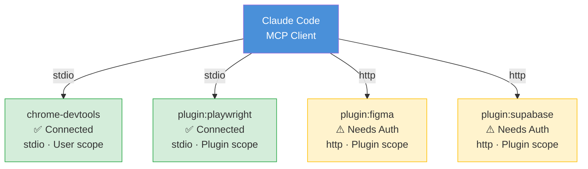
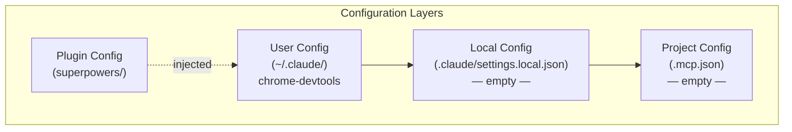

# mcp 可视化设计方案

## 可视化方向建议

### 方向一：MCP 服务器拓扑图（推荐优先实现）

展示 Claude Code 与所有 MCP 服务器的连接拓扑、传输方式和健康状态。

```
                    ┌─────────────────────┐
                    │    Claude Code       │
                    │    (MCP Client)      │
                    └─────────┬───────────┘
                              │
            ┌─────────────────┼──────────────────┐
            │                 │                   │
            ▼                 ▼                   ▼
   ┌────────────────┐ ┌──────────────┐ ┌──────────────────┐
   │  chrome-devtools│ │  playwright  │ │  figma           │
   │  ✅ Connected   │ │  ✅ Connected│ │  ⚠️ Needs Auth   │
   │  stdio          │ │  stdio       │ │  http            │
   │  User scope     │ │  Plugin scope│ │  Plugin scope    │
   └────────────────┘ └──────────────┘ └──────────────────┘
            │                 │                   │
            │                 │                   ▼
            │                 │          ┌──────────────────┐
            │                 │          │  supabase        │
            │                 │          │  ⚠️ Needs Auth   │
            │                 │          │  http            │
            │                 │          │  Plugin scope    │
            │                 │          └──────────────────┘
```

**Mermaid 代码:**



### 方向二：配置范围层级图

展示三级配置的继承和覆盖关系。



### 方向三：服务器能力矩阵

展示每个 MCP 服务器提供的工具列表。

```
┌─────────────────┬────────────────────────────────────────────┐
│ Server          │ Available Tools                             │
├─────────────────┼────────────────────────────────────────────┤
│ chrome-devtools │ click, fill, navigate, screenshot,         │
│                 │ snapshot, evaluate, lighthouse, trace...   │
├─────────────────┼────────────────────────────────────────────┤
│ playwright      │ browser_click, browser_snapshot,            │
│                 │ browser_navigate, browser_type...           │
├─────────────────┼────────────────────────────────────────────┤
│ figma           │ 🔒 Needs authentication                    │
├─────────────────┼────────────────────────────────────────────┤
│ supabase        │ 🔒 Needs authentication                    │
└─────────────────┴────────────────────────────────────────────┘
```

## 用户交互流程

1. 用户查看拓扑图 → 快速了解所有服务器状态
2. 点击服务器节点 → 展开详情（配置、工具列表、连接日志）
3. 认证状态服务器 → 一键跳转 OAuth 认证流程
4. 添加/移除服务器 → 可视化 CRUD 操作

## 数据流设计

```
claude mcp list  →  [解析输出]  →  { name, status, type, scope }[]
claude mcp get <name>  →  [解析输出]  →  { name, scope, status, type, command, args, env }
       │
       ▼
  [状态聚合] → 连接状态 + 认证状态 + 工具列表
       │
       ▼
  [可视化渲染] → 拓扑图 / 矩阵 / 层级图
```

## 技术建议

- `mcp list` 和 `mcp get` 的输出格式稳定，适合正则解析
- 拓扑图为核心视图，建议优先实现
- 可扩展支持实时健康检查刷新（定时执行 `mcp list`）
- 配置范围可视化有助于排查"为什么服务器不生效"类问题
- 建议集成到 IDE 侧边栏作为 MCP 管理面板
