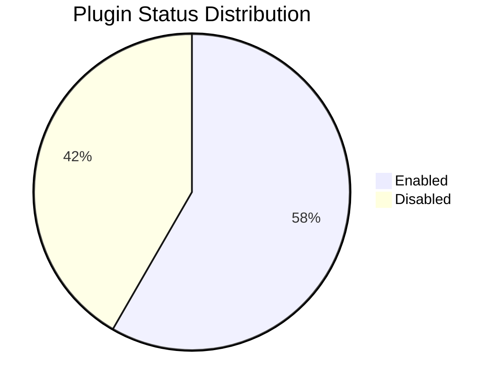

# plugin 可视化设计方案

## 可视化方向建议

### 方向一：插件生态面板（推荐优先实现）

类似 VS Code Extensions 的管理界面，提供安装/启用/更新一站式管理。

```
┌────────────────────────────────────────────────────────────────┐
│  🔌 Plugin Manager                              [🔍 Search]   │
├────────────────────────────────────────────────────────────────┤
│                                                                 │
│  INSTALLED (12)                                                 │
│  ┌──────────────────────────────────────────────────────────┐  │
│  │ ✅ superpowers      v5.0.7   user   ● enabled   [⚙️][🗑]│  │
│  │ ✅ figma            v2.0.7   user   ● enabled   [⚙️][🗑]│  │
│  │ ✅ playwright       v52e..   user   ● enabled   [⚙️][🗑]│  │
│  │ ✅ frontend-design  v52e..   user   ● enabled   [⚙️][🗑]│  │
│  │ ✅ supabase         v52e..   user   ● enabled   [⚙️][🗑]│  │
│  │ ✅ typescript-lsp   v1.0.0   user   ● enabled   [⚙️][🗑]│  │
│  │ ✅ rust-analyzer    v1.0.0   user   ● enabled   [⚙️][🗑]│  │
│  │ 🔘 code-review     v52e..   local  ○ disabled  [⚙️][🗑]│  │
│  │ 🔘 github          v52e..   local  ○ disabled  [⚙️][🗑]│  │
│  │ 🔘 gitlab          v52e..   user   ○ disabled  [⚙️][🗑]│  │
│  │ 🔘 agent-sdk-dev   v52e..   local  ○ disabled  [⚙️][🗑]│  │
│  │ 🔘 context7        v52e..   local  ○ disabled  [⚙️][🗑]│  │
│  └──────────────────────────────────────────────────────────┘  │
│                                                                 │
│  MARKETPLACES                                                   │
│  • claude-plugins-official                                      │
│                                                                 │
└────────────────────────────────────────────────────────────────┘
```

### 方向二：插件状态分布图

以可视化方式展示插件的整体状态分布。



```
Scope Distribution:
  User  ████████████████  7 plugins
  Local ████████████      5 plugins
```

### 方向三：Marketplace 浏览器

可搜索和分类浏览的插件市场。

```
┌────────────────────────────────────────────────┐
│  🏪 Plugin Marketplace                         │
│                                                 │
│  [🔍 Search plugins...]                        │
│                                                 │
│  Categories:                                    │
│  [All] [Dev Tools] [Design] [Database] [VCS]   │
│                                                 │
│  ┌────────────────────────────────────────────┐│
│  │ 🎨 figma                                    ││
│  │ Figma design integration                    ││
│  │ v2.0.7 · ✔ installed                        ││
│  │ [Install] [Details]                         ││
│  ├────────────────────────────────────────────┤│
│  │ 🎭 playwright                               ││
│  │ Browser automation and testing              ││
│  │ v52e.. · ✔ installed                        ││
│  │ [Install] [Details]                         ││
│  └────────────────────────────────────────────┘│
└────────────────────────────────────────────────┘
```

## 用户交互流程

1. 用户打开插件面板 → 查看已安装插件和状态
2. 切换启用/禁用 → 一键切换，无需命令行
3. 搜索可用插件 → 从 marketplace 浏览和安装
4. 更新检查 → 提示有新版本可用的插件

## 数据流设计

```
claude plugin list
       │
       ▼
  [输出解析] → { name, version, scope, status }[]
       │
       ▼
claude plugin marketplace list
       │
       ▼
  [聚合数据] → 已安装 + 可用插件
       │
       ▼
  [UI 渲染] → 生态面板 / 状态图 / 浏览器
```

## 技术建议

- `plugin list` 输出格式稳定，适合正则解析
- 建议实现为 IDE 侧边栏面板（类 VS Code Extensions）
- 市场浏览功能需 marketplace API 支持
- 启用/禁用操作可直接调用 `claude plugin enable/disable`
- 更新检查可定时后台运行，结果缓存展示
