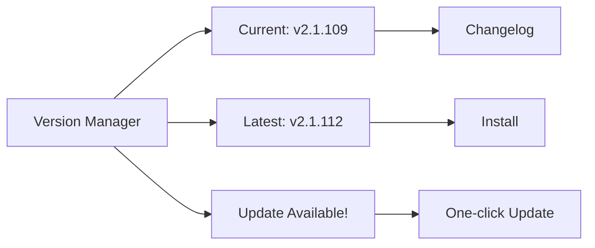

# update 可视化设计方案

## 可视化方向建议

### 方向一：版本状态通知栏

在 IDE 状态栏中显示版本状态。

```
┌──────────────────────────────────────────┐
│  Claude Code v2.1.109  ✅ Up to date     │
│                                           │
│  Last checked: 2026-04-15 14:30          │
│  [Check Now] [View Changelog]            │
└──────────────────────────────────────────┘
```

### 方向二：更新流程可视化

当有新版本可用时的更新引导。

```
┌──────────────────────────────────────────┐
│  📦 Update Available                      │
│                                           │
│  Current: v2.1.109                        │
│  Latest:  v2.1.112                        │
│                                           │
│  What's New:                              │
│  • Fixed memory leak in session store     │
│  • Added --json-schema support            │
│  • Improved MCP connection stability      │
│                                           │
│  [Skip] [View Full Changelog] [Update]   │
└──────────────────────────────────────────┘
```

### 方向三：合并到版本管理模块

与 install 可视化合并，统一展示版本管理功能。



## 用户交互流程

1. 启动时自动检查更新 → 状态栏显示版本状态
2. 有新版本 → 弹出更新通知
3. 用户确认 → 执行更新并展示进度

## 数据流设计

```
claude update (定时/手动)
       │
       ▼
  [输出解析] → { currentVersion, latestVersion, isUpToDate }
       │
       ▼
  [状态判断] → up-to-date / update-available / update-failed
       │
       ▼
  [UI 渲染] → 状态栏 / 通知 / 进度条
```

## 技术建议

- 优先级低，建议与 install 合并为"版本管理"模块
- 可集成到 IDE 状态栏，定时后台检查
- Changelog 展示需额外数据源（GitHub releases 或 npm registry）
